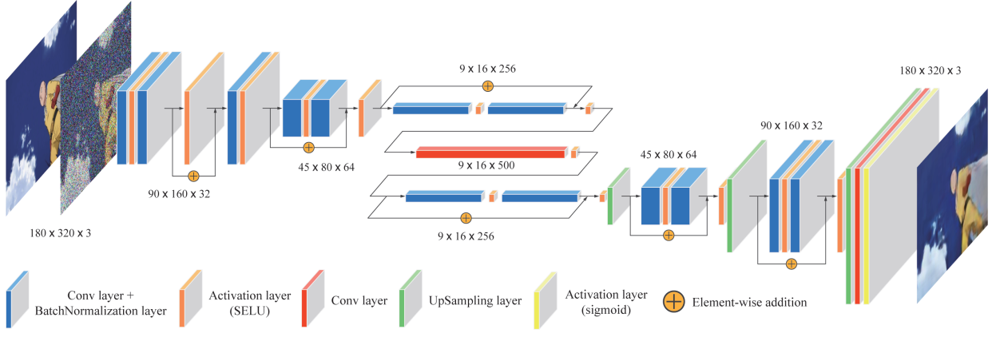
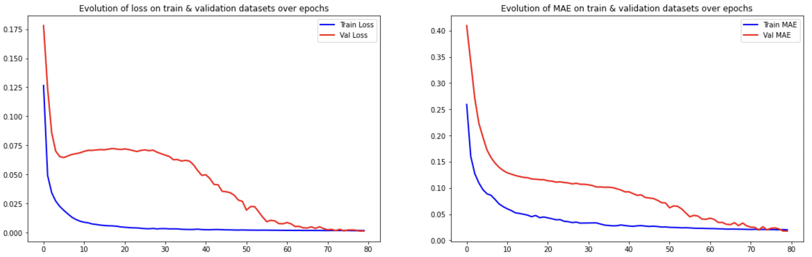
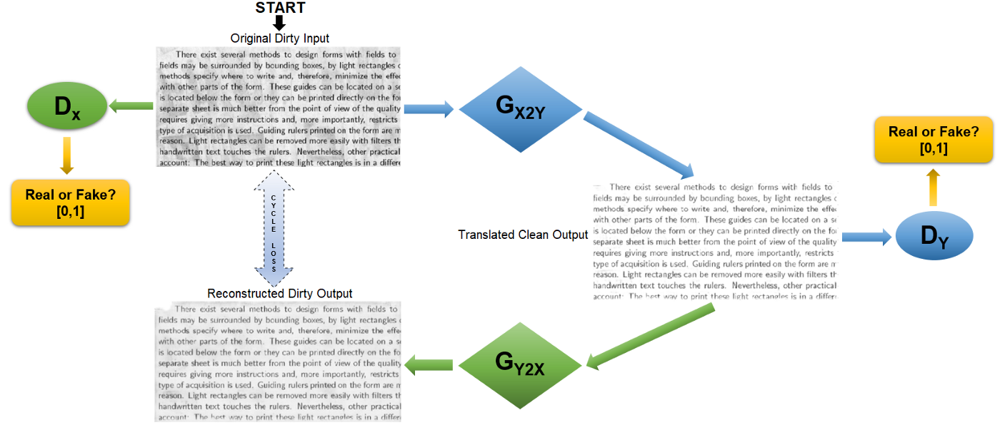
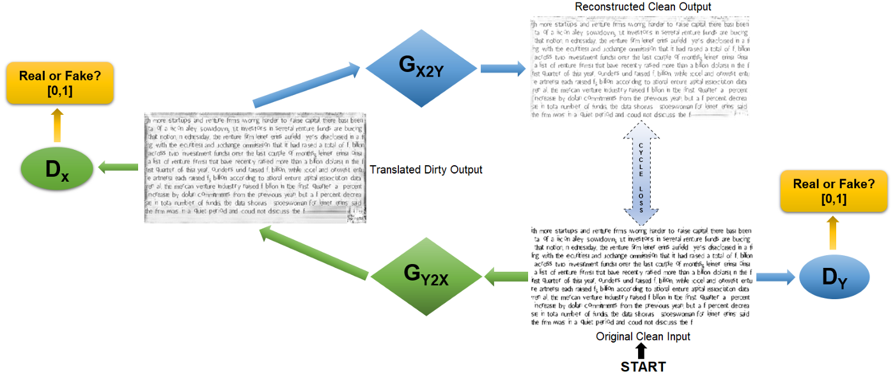
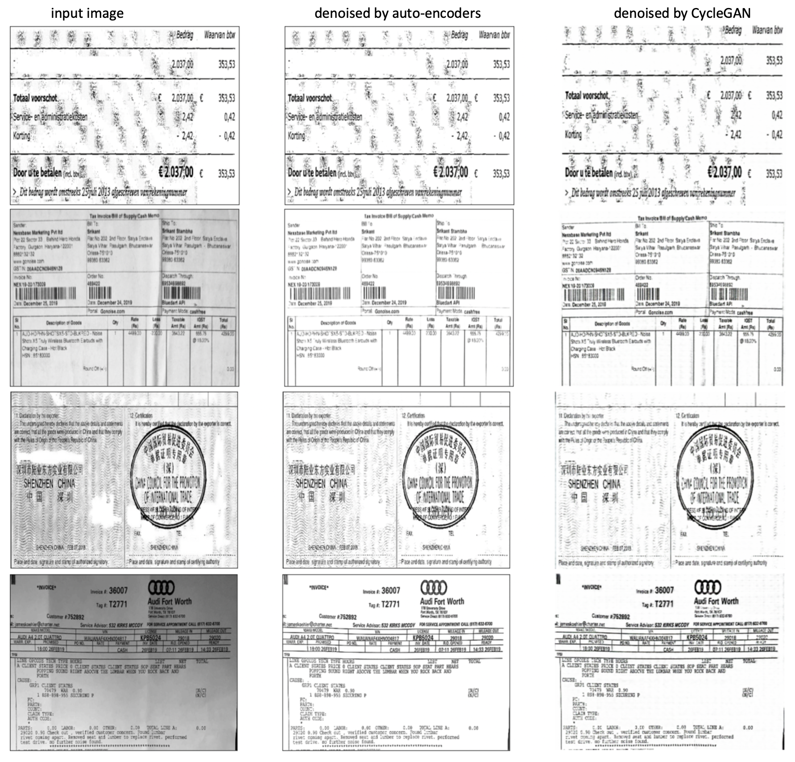

# Document Denoise

## Background
Document Denoising is used in the pre-processing stage of OCR. There are many denoising techniques, this repository implements two _deep learning_ methods - Denoising by **Auto-encoders** and **CycleGAN**.

The work is based on relevant papers and implementations:
- Auto-encoders [[paper](https://ieeexplore.ieee.org/document/8262546)] [[code](https://www.kaggle.com/competitions/denoising-dirty-documents/code)]
- CycleGAN [[paper](https://arxiv.org/abs/1703.10593)] [[code](https://www.tensorflow.org/tutorials/generative/cyclegan)]

The training/testing dataset is downloaded from [Kaggle - Denoising Dirty Documents](https://www.kaggle.com/competitions/denoising-dirty-documents). The zipped dataset is stored in `./zip/` for direct use.

Please see the two notebooks [[Auto-encoders](./training_ae.ipynb)] [[CycleGAN](./training_cg.ipynb)] for more details.

For denoising images using pre-trained models from the notebooks above, please refer to the following notebooks [[Auto-encoders](./denoising_ae.ipynb)] [[CycleGAN](./denoising_cg.ipynb)].

## Models

### Auto-encoders
- Model Overview

- Parameter Settings
    - Epoch: 80
    - Batch size: 12
    - Input/output size: 540*420
    - Data split on training set: 85% training, 15% validation
    - Optimizer: Adam
    - Learning rate: 0.001
    - Loss: mean squared error (MSE)
    - Metrics: mean absolute error (MAE)
- Error evolution on epochs

### CycleGAN
- Model Overview
    - Conversion of original dirty input to its translated clean output
    
    - Conversion of original clean input to its translated dirty output
    
- Parameter Settings
    - Epoch: 80
    - Batch size: 6
    - Input/output size: 512*512
    - Data split on training set: 100% training
    - Optimizer: Adam (beta_1=0.5)
    - Learning rate: 0.0002
    - Loss: cycle consistency loss
- Training Process
    - Forward Mapping
    
    - Backward Mapping
    

## Comparison

### Training
- Hardware
    - GPU: NVIDIA Tesla T4 (16G)
    - Platform: [Google Colab](https://colab.research.google.com)
- Training Time
    - Auto-encoders: 8s/epoch
    - CycleGAN: 87s/epoch
- Prediction Time
    - Auto-encoders: <1s/image
    - CycleGAN: <1s/image

### Results
- Performance on [test set](https://www.kaggle.com/competitions/denoising-dirty-documents/data)

- Preformance on [invoice images](https://www.google.com/search?q=noisy+invoice&tbm=isch&sxsrf=ALiCzsYRG6sIvU0n92yRWrcYLenFaEWeig%3A1655730210306&source=hp&biw=1438&bih=823&ei=InCwYqfwENDXgQajyauwBQ&iflsig=AJiK0e8AAAAAYrB-MsEzgLgBBgGm8KyXcYTcnNoH_Cs1&oq=&gs_lcp=CgNpbWcQAxgBMgcIIxDqAhAnMgcIIxDqAhAnMgcIIxDqAhAnMgcIIxDqAhAnMgcIIxDqAhAnMgcIIxDqAhAnMgcIIxDqAhAnMgcIIxDqAhAnMgcIIxDqAhAnMgcIIxDqAhAnUABYAGC9D2gBcAB4AIABAIgBAJIBAJgBAKoBC2d3cy13aXotaW1nsAEK&sclient=img)

## Other Pre-processing Methods

### Skew Correction
*Skew Correction* using *Hough Transform* is implemented [here](./skew_correction.ipynb). The steps are:
1. Apply _Canny filter_ (sigma=1) to detect edges (the filtered image is shown in right below)
2. Find _Hough_ lines between 75-to-105-degree angle (which is in horizontal direction, shown in red lines)
3. Find the angle with the highest occurrence in these lines, then rotate the image with that angle

### Binarization
*Local Adaptive Thresholding* implemented by MATLAB is provided [here](./adaptive_threshold.m), which is optimized to be an effective binarization method.

## OCR Techniques
To demonstrate the effect of pre-processing on OCR results, several open-source OCR techniques are included, along with methods to visualize OCR result. Please see following notebooks [[Tesseract-OCR](./tesseract_ocr.ipynb)] [[EasyOCR](./easy_ocr.ipynb)] [[PaddleOCR](./paddle_ocr.ipynb)] for details.

Other works done in this project, including _table structure recognition_, _table cell extraction_ and _recognition accuracy system_ are involved in [this](./table_recognition.ipynb) notebook.